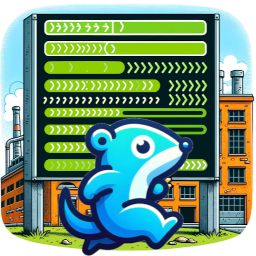

# *Row-Runner-CLI!*
[](https://goreportcard.com/report/github.com/mahe54/row-runner-cli)
[](https://godoc.org/github.com/mahe54/row-runner-cli)
[](https://travis-ci.org/mahe54/row-runner-cli)
[](https://coveralls.io/github/mahe54/row-runner-cli?branch=main)

<br>
<div align="center">



</div>


## Introduction
Row Runner is a versatile CLI tool designed for efficient processing of CSV data. It is capable of handling CSV input from various sources, including files and other `io.Reader` implementations, making it a flexible solution for different data processing needs.

## Features
- **Parallel Processing**: Processes CSV data from files or any `io.Reader` source in parallel, enhancing performance.
- **Real-time Progress Tracking**: Each process is accompanied by a progress bar with status updates like starting, working, error, etc.
- **Scalability and Performance**: Optimized to handle large datasets efficiently.
- **Visual Feedback**: Provides visual feedback on the progress of each process.


## Installation
```bash
# Example installation command
go install github.com/mahe54/row-runner-cli
```

# Example usage command
row-runner-cli [options] <input-source>

id, data
1, sample1
2, sample2

## Contributing

### We welcome contributions to Row Runner! If you have improvements or fixes, please follow these steps:

1. Fork the repository.
2. Make your changes.
3. Submit a pull request with a clear description of the changes.


# A Generic CLI with visual feedback
## Concurrent Processing of Long-Running Tasks

The `examples/simple/main.go` program demonstrates how to perform concurrent processing of long-running tasks using goroutines and channels in Go. The program reads a csv list and processes them in paralell. The progress of each csw row is displayed using an ASCII progress bar.
Progress bars are implemented by using Vladimir Bauer - vbauerster [mpb](https://github.com/vbauerster/mpb/v8) package.


### Usage
```bash
Usage of main:
  -file string
    	Input file to process (default "./input.csv")
  -log string
    	Log file name (default "app.log")
  -s int
    	Semaphore size (default 2)
```


For use with your own types and interface implementation.

This is the more complex example reading a csv with information about 'cars' and processing them in parallel,
and has status feedback for when the car is being processed, when it fails, when it is being retried and when it is completed etc. You can control the whole flow very easily.


```go
// This is a sample on how you could implement the package in your own CLI
package main

import (
	"flag"
	"log"
	"math/rand"
	"time"

	lib "github.com/mahe54/generic-go-cli-file-input/pkg"
	"github.com/vbauerster/mpb/v8"
)

type Car struct {
	RegNumber string
	Brand     string
	Model     string
	Year      string
	Mileage   string
	Insured   bool
}

type MyCreatorImpl struct{}


func (t MyCreatorImpl) ProcessInput(input interface{}, bar *mpb.Bar, progress chan<- int, cancel <-chan struct{}, statusChan chan<- lib.Status, status *lib.Status) {

	car := input.(Car)
	retry := false

    sleepTime := time.Duration(rand.Intn(1000)+500) * time.Millisecond
	
    //Simulation of work
	time.Sleep(sleepTime)
	statusChan <- lib.Status{Current: lib.Working}

	//Report progress
	progress <- 25

	//Simulate some more work
	time.Sleep(sleepTime)

	//Report progress
	progress <- 50

	//Simulate some even more work, that might fail 50% chance
	time.Sleep(sleepTime)
	if rand.Intn(100) < 50 {
		retry = true
		statusChan <- lib.Status{Current: lib.Error}
		log.Printf("Error processing car: %s", car.RegNumber)
        time.Sleep(sleepTime)
	}

	for retry {
		//Simulate some even more work, that might succed 50% chance to recover
		statusChan <- lib.Status{Current: lib.Retrying}
		time.Sleep(sleepTime)
		if rand.Intn(100) < 50 {
			statusChan <- lib.Status{Current: lib.Working}
			log.Printf("recovered: %s", car.RegNumber)
            time.Sleep(sleepTime)
			retry = false
		} else {
            time.Sleep(sleepTime)
			log.Printf("Error processing car: %s", car.RegNumber)
			statusChan <- lib.Status{Current: lib.Failed}
			return
		}
	}

	//Report progress
    time.Sleep(sleepTime)
	progress <- 75

	//Simulate some even more work
	time.Sleep(sleepTime)
    progress <- 85

	//Report progress
	progress <- 100
	statusChan <- lib.Status{Current: lib.Completed}

}

func (t MyCreatorImpl) ConvertToInput(data []string) interface{} {

	return Car{
		RegNumber: data[0],
		Brand:     data[1],
		Model:     data[2],
		Year:      data[3],
		Mileage:   data[4],
		Insured:   data[5] == "true",
	}
}

func main() {
	inputFile := flag.String("file", "./input.csv", "Input file to process")
	semaphoreSize := flag.Int("s", 2, "Semaphore size")
	logFileName := flag.String("log", "app.log", "Log file name")

	flag.Parse()

	creator := MyCreatorImpl{}
	inputs, err := lib.ReadDataFromFile(*inputFile, creator)
	if err != nil {
		log.Fatal(err)
	}

	lib.Start(creator, inputs, *semaphoreSize, *logFileName)
}

```

Output

When you run the program, it reads the input and handles each (csv) row with the semaphoresize given.
The semaphoresize is the amount of goroutines that will be running at the same time (in parallel).